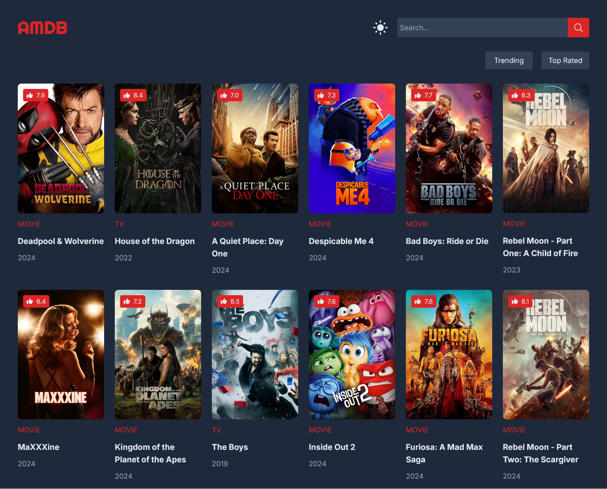
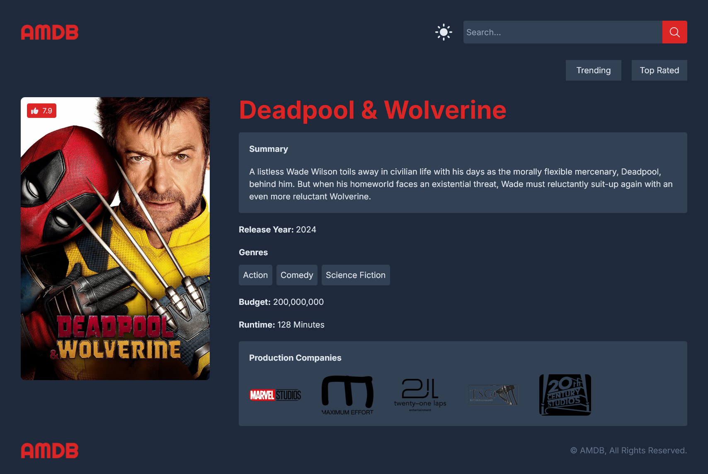

# AMDB

A IMDb clone made with NextJS.

| Preview                                      |
| -------------------------------------------- |
| *Homepage*<br/>           |
| *Movie Details Page*<br/> |

---

## Requirements

- npm >= 10.7.0

- node >= 20.12.2

---

## Environment Variables

You will need to create and add the following environment variables to your `.env` file

`TMDB_API_KEY=YOUR_TMDB_API_KEY`

---

## Installation

Open `cmd` or `bash` in the project directory.

```bash
npm install
```

## Run Locally

```bash
npm run dev
```

## License

[MIT](https://choosealicense.com/licenses/mit/)
